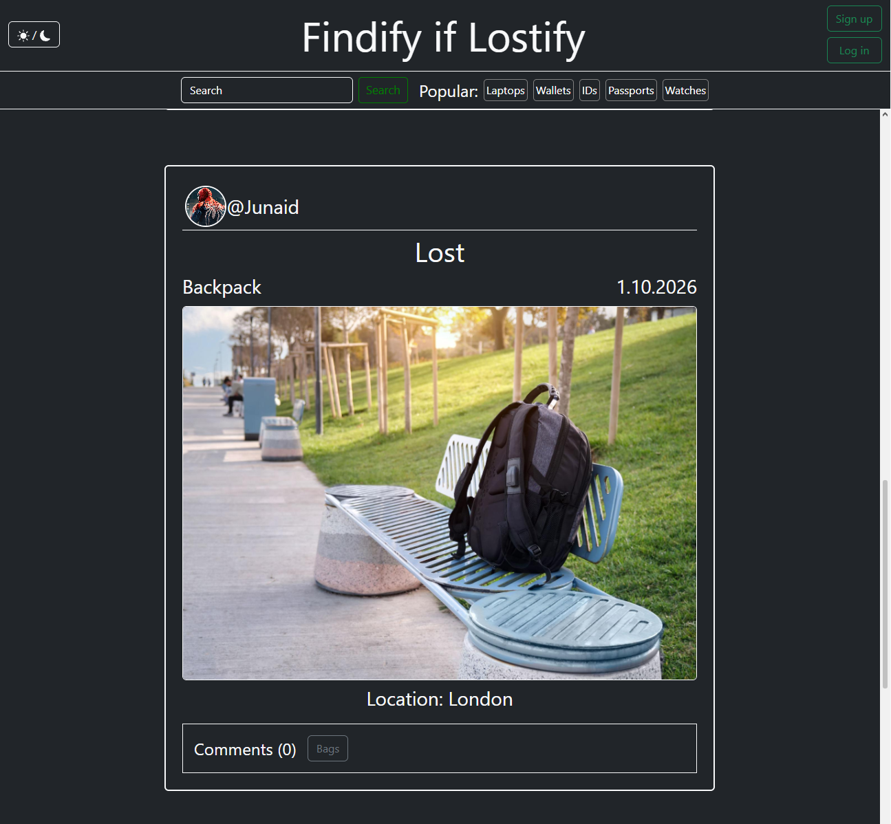
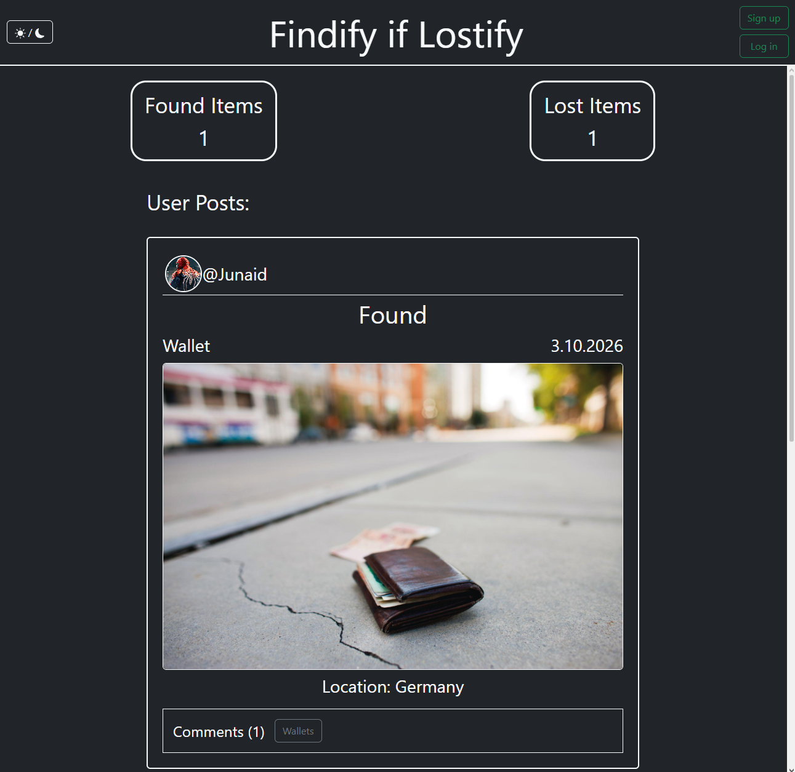
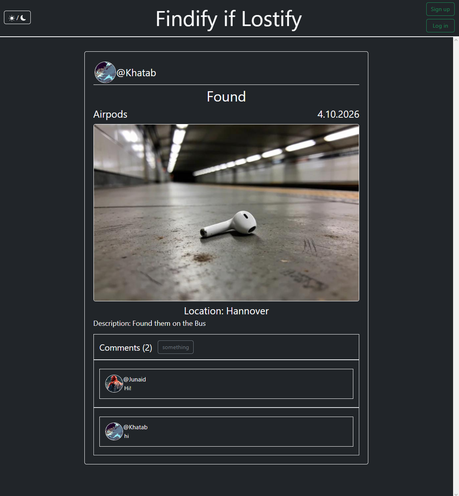
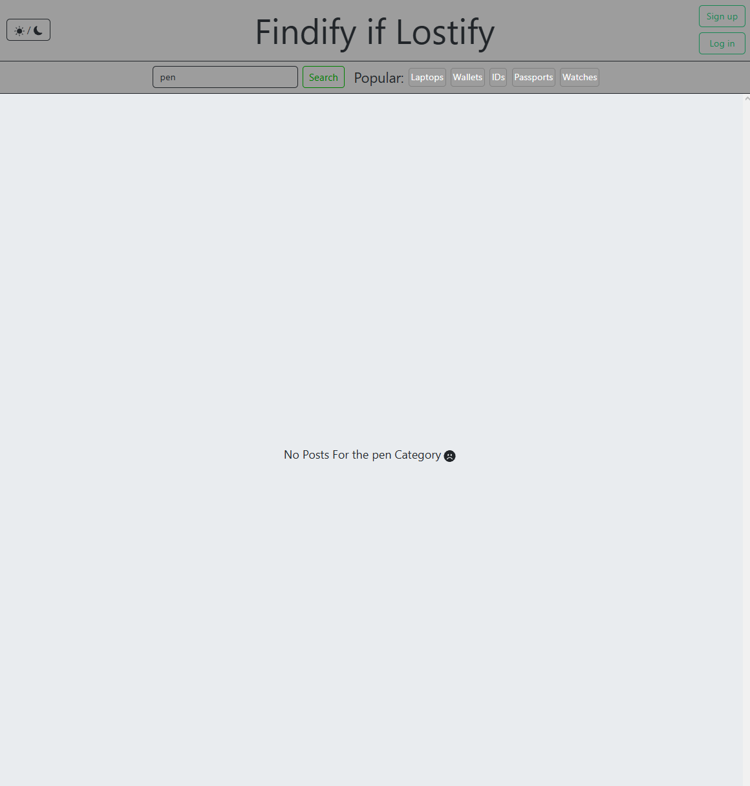

# Findify

Findify is a full-stack lost-and-found web application that allows users to report lost or found items, browse existing posts, search and filter listings, and manage their own posts.

🌐 **Live Demo:** https://findify-if-lostify.vercel.app

## Features

- User registration and login
- JWT-based authentication
- Create lost and found posts
- Upload images for posts
- User profile pictures
- Search for lost and found items
- Filter posts by category
- Edit and delete posts
- Comment on posts
- Personal profile page displaying the user's posts
- Responsive user interface
- Persistent image storage using Cloudinary

## Tech Stack

### Frontend

- React
- Vite
- JavaScript
- Bootstrap
- Axios

### Backend

- Node.js
- Express.js
- MongoDB
- Mongoose
- JWT
- bcrypt
- Multer
- Cloudinary

### Deployment

- **Frontend:** Vercel
- **Backend:** Render
- **Database:** MongoDB Atlas
- **Image Storage:** Cloudinary

## Architecture

```text
React + Vite
     │
     │ HTTP / Axios
     ▼
Node.js + Express
     │
     ├──── MongoDB Atlas
     │
     └──── Cloudinary
```

The frontend communicates with the Express REST API using Axios. Authentication is handled using JSON Web Tokens (JWT), while MongoDB stores application and user data. Uploaded images are stored externally using Cloudinary.

## Screenshots

### Home Page



### Profile Page



### Comment Page



### Category Page (Light Mode)



## Running Locally

### 1. Clone the repository

```bash
git clone https://github.com/junaidabdulazeez10-tech/FindifyIfLostify.git
```

### 2. Backend

Navigate to the backend:

```bash
cd backend
npm install
```

Create a `.env` file:

```env
MONGO_URI=your_mongodb_connection_string
SECRET=your_jwt_secret

CLOUDINARY_CLOUD_NAME=your_cloudinary_cloud_name
CLOUDINARY_API_KEY=your_cloudinary_api_key
CLOUDINARY_API_SECRET=your_cloudinary_api_secret
```

Start the backend:

```bash
npm run dev
```

### 3. Frontend

Navigate to the frontend:

```bash
cd frontend/LostifyIfFindify
npm install
```

Create a `.env` file:

```env
VITE_API_URL=http://localhost:5000
```

Start the frontend:

```bash
npm run dev
```

## Docker

The application can also be run using Docker.

From the project root:

```bash
docker compose up --build
```

## What I Learned

Building Findify gave me practical experience developing and deploying a full-stack application, including:

- Building REST API endpoints with Express
- Working with MongoDB and Mongoose
- Implementing authentication with JWT and bcrypt
- Handling multipart form data and image uploads
- Integrating Cloudinary for persistent image storage
- Connecting a React frontend to a REST API
- Managing environment variables across development and production
- Containerizing an application with Docker
- Deploying separate frontend and backend services

## Future Improvements

Possible future additions include:

- Real-time chat between users
- Email notifications
- Improved post matching between lost and found items
- Additional account and profile management features

## Author

**Junaid Imad Abdulazeez Almohammadi**

GitHub: https://github.com/junaidabdulazeez10-tech